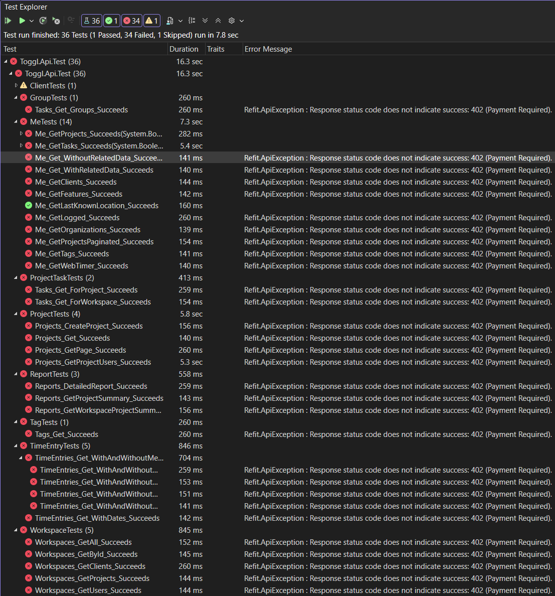

# Toggl.Api nuget package

# IMPORTANT NOTICE - SUPPORT DROPPED UNTIL TOGGL RELAXES THEIR API LIMITS

**In September 2025, Toggl crippled their API, limiting even Premium users to 600 API calls per hour.
Beyond that, you will receive HTTP 402 "Payment Required" response (an incorrect HTTP Status - it should be 429 "Too Many Requests").**

We can't even run our regression test sets, so I'm afraid this library is now untestable and therefore unsupportable.

There is nothing we can do but hope they see sense and lift the limits.

**You can provide your feedback to Toggl here: https://community.toggl.com/**

---

## Description

This is a .NET 10.0 library for the Toggl API.

We now only provide Toggl API v9 support.  Many endpoints are currently missing.  Your pull requests are welcome!

## Breaking change
**To avoid the conflict with System.Threading.Tasks.Task, we have renamed the Task class to ProjectTask.
This will require you to update your code to use ProjectTask instead of Task.**

## Contributing

This project is developed using Refit and System.Text.Json.

Add interfaces for new endpoints in the `Interfaces` folder.
Add models in the `Models` folder.
Add unit tests in the `Toggl.Api.Tests` project.

Refer to the Toggl API documentation for more information on the endpoints and models here: https://engineering.toggl.com/docs/
